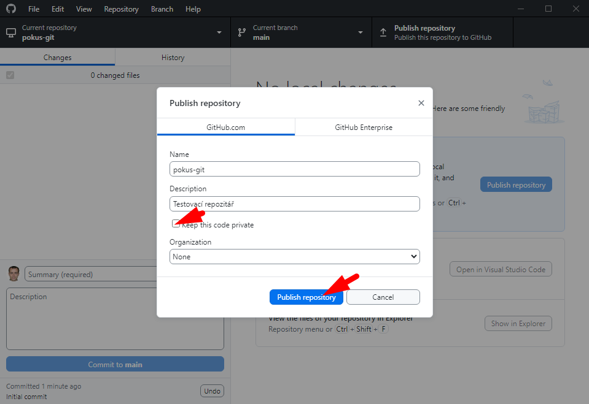
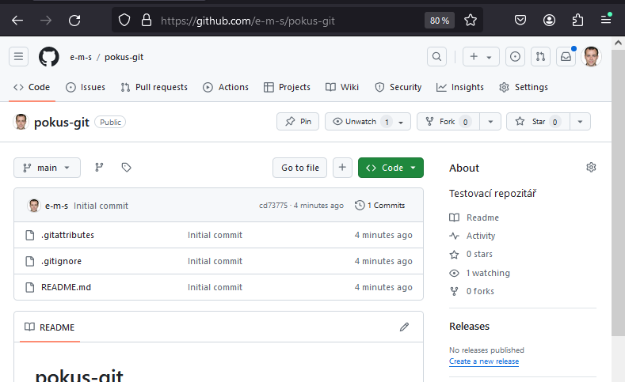

# Použití Gitu a GitHubu s Greenfootem

## Co používáme
1. _Git_ - nástroj pro sledování historie projektu
2. _GitHub_ a podobné služby - servery pro sdílení kódu
3. _GitHub Desktop_ ... aplikace - grafické uživatelské rozhraní ke Gitu, propojené s GitHubem

## Vytvoření účtu na GitHubu (pokud již nemáte)

Pro vytvoření účtu použijte [návod na OAUH učebnice](https://github.com/oauh-ucebnice/github-registrace).

## Instalace GitHub Desktop

Postup...

1.  
1.  
1.  

## Založení repozitáře a vytvoření projektu Greenfootu

### Založení repozitáře

> Repozitář vytvoří pouze jeden člen skupiny. Tento člen publikuje repozitář na GitHub. Ostatní členové skupiny si pak repozitář naklonují.

Postup...

1.  
1.  
1.  
1.  
1.  
1.  

### Kontrola a povolení přístupu ostatním

Repozitář nastavujeme jako veřejný, takže jeho obsah může vidět kdokoli. Ale přispívat do něj může ve výchozím nastavení jen autor. Ostatním členům skupiny musí autor repozitář zpřístupnit.

Postup...

1.  
1.  

Uvedeným členům skupiny pošlete pozvánku pomocí _Add Member_. Pozvánka jim dojde mailem a zároveň se zobrazí na GitHubu. Teprve až pozvánku přijmou, můžou do repozitáře přispívat.

> Pokud byste omylem vytvořili privátní rezpozitář (není viditelný veřejně), můžete toto nastavení změnit viz žlutá šipka.

## Zápis kódu a odeslání změn na GitHub

Postup...

1. Při první vytvoření do repozitáře zkopírujeme kód 

> Později už měníme existující kód. Otevřeme si projekt v&nbsp;Greenfootu a píšeme stejně, jak jsme zvyklí.

2. Každou novou funkčnost bychom měli zapsat jako nový commit 

3. Uložené commity poté můžeme odeslat do vzdáleného repozitáře 
4. Po odeslání commitů se aktuální stav projektu objeví i ve vzdáleném repozitáři 

> Dokud neprovedeme operaci „push“, ostatní členové projektu naše změny neuvidí.

Než si projekt otevřeme po delší době, měli bychom si načíst změny, které provedli mezitím naši kolegové:

1.  

## Stažení existujícího projektu z GitHubu

Postup...

1.  
1.  
1.  

## Stažení nových změn ze vzdáleného rezpozitáře

Popis a postup...

V&nbsp;době, kdy s&nbsp;repozitářem nepracujete, mohlo dojít k&nbsp;nahrání nových commitů do vzdáleného repozitáře.
Mohlo to nastat tak, že:
- Někdo z&nbsp;vašich kolegů nahrál do vzdáleného repozitáře své úpravy.
- Vy jste provedli úpravy projektu na jiném počítači a nahráli změny do repozitáře.

Před začátkem další práce je třeba tyto commity stáhnout tak, abyste měli k&nbsp;dispozici aktuální verzi kódu (pozor, toto se neprovádí automaticky).

1.  

