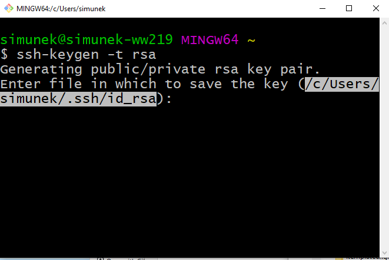

# Použití Gitu a GitHubu s IntelliJ IDEA

## Vložení klíče na GitHub

Postup...

1.  
1.  
<!--1.  -->
1.  
1.  
1.  
1.  
1.  
1.  
1.  
1.  

## Práce s GitHubem v IntelliJ IDEA

1.  
1.  
1.  
1.  
1.  
1.  
1.  
1.  
1.  
1.  
1.  
1.  
1.  
1.  
1.  
1.  