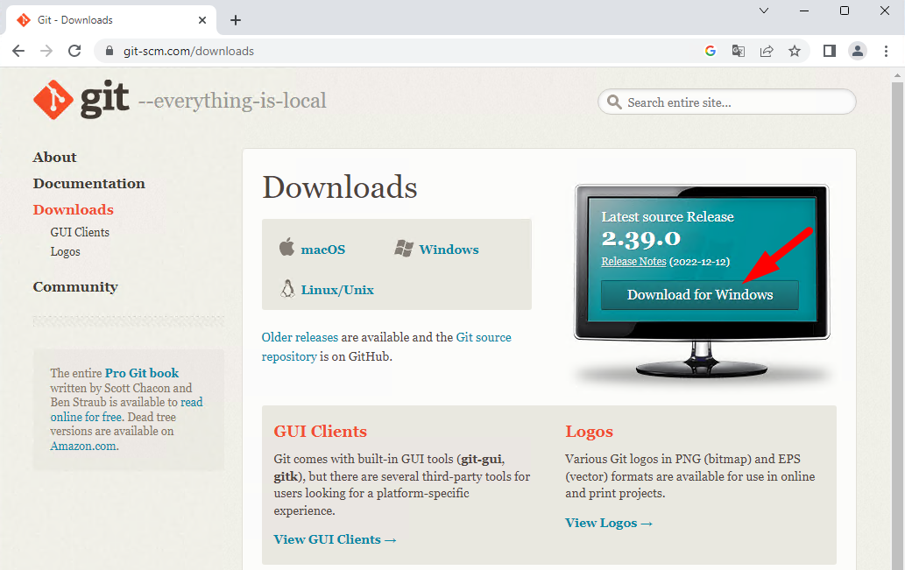
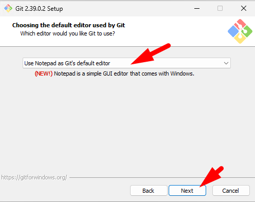

# Použití Gitu a GitHubu s IntelliJ IDEA

## Vytvoření účtu na GitHubu (pokud již nemáte)

Pro vytvoření účtu použijte [návod na OAUH učebnice](https://github.com/oauh-ucebnice/github-registrace).


## Instalace Gitu (pokud již nemáte)

Ve škole tento krok není třeba, protože je Git již nainstalován.

   <details><summary>Postup...</summary>
1. Git stáhnete ze stránek: [git-scm.com](https://git-scm.com/download/).

1. Při instalaci je třeba potvrdit větší množství voleb, ale většinu z&nbsp;nich lze ponechat ve výchozím nastavení. Změňte si pouze výchozí editor pro úpravu commit message.

   <details><summary>První část postupu (zvolte sami či ponechte výchozí)...</summary>

    1. <br />
    1. <br />
    1. <br />
    1. <br />
    1. <br />
    1. <br />

   </details>


1. Zvolte textový editor pro instalaci<br />
   - Zvolte si editor podle své volby. Můžete například použít výchozí editor pro Windows: Notepad
   > Pokud jste na editor _vim_ zvyklí, samozřejmě si můžete ponechat _vim_. Pro běžného uživatele počítače bez dalších zkušeností ale _vim_ není příliš intuitivní na ovládání!

   - <br />.

1. Zbytek instalace už nejspíš můžete ponechat beze změny (volby se mohou lišit)

   <details><summary>Druhá část postupu (zvolte sami či ponechte výchozí)...</summary>

    1. <br />
    1. <br />
    1. <br />
    1. <br />
    1. <br />
    1. <br />
    1. <br />
    1. <br />
    1. <br />
    1. <br />
    1. <br />


   </details>

</details>


## Vložení klíče na GitHub

<details><summary>Postup...</summary>

1. <br />
1. Nastavte si uživatelské jméno pro zápis autora změn.<br />Použijte uživatelské jméno a e-mail vašeho účtu na GitHubu:
    ```bash
    git config --global user.email "vas-email@domena.cz"
    git config --global user.name "Uživatelské jméno na GitHubu"
    ```
    <br />
1. Spusťte `ssh-keygen` a nechte si vygenerovat klíče:
    ```bash
    ssh-keygen -t rsa
    ```
    <br />
    1. Pokud už jste někdy klíč vytvářeli, můžete použít ten původní.
    1. Cestu ke klíči ponechte výchozí.
    1. Heslo doporučujeme nezadávat, protože byste ho museli zadávat při každém commitu.
1. <br />
1. <br />
1. <br />
1. <br />
1. <br />
1. <br />
1. <br />
1. <br />

</details>

## Vytvoření projektu IntelliJ a odeslání na GitHub
<details><summary>Postup...</summary>

1. <br />
1. <br />
1. <br />
1. <br />
1. <br />
1. <br />
1. <br />

</details>

## Odeslání změn na GitHub

<details><summary>Postup...</summary>

1. <br />
1. <br />
1. <br />
1. <br />
1. <br />
1. <br />

</details>

## Stažení existujícího projektu z GitHubu do IntelliJ

<details><summary>Postup...</summary>

1. Zkopírujte si adresu repozitáře:<br />
1. Zadejte adresu do úvodního okna po spuštění IntelliJ:<br />
   Pokud máte otevřen jiný projekt, zavřete ho.<br />
1. <br />

</details>

## Stažení nových commitů ze vzdáleného rezpozitáře

<details><summary>Postup...</summary>

V&nbsp;době, kdy s&nbsp;repozitářem nepracujete, mohlo dojít k&nbsp;nahrání nových commitů do vzdáleného repozitáře.
Mohlo to nastat tak, že:
- Někdo z&nbsp;vašich kolegů nahrál do vzdáleného repozitáře své úpravy.
- Vy jste provedli úpravy projektu na jiném počítači a nahráli změny do repozitáře.

Před začátkem další práce je třeba tyto commity stáhnout tak, abyste měli k&nbsp;dispozici aktuální verzi kódu (pozor, toto se neprovádí automaticky).

1. Otevřete si projekt v&nbsp;IntelliJ a stiskněte „modrou šipku dolů“ („Update project“):<br />
   
1. Pokud jste provedli nové commity a ve vzdáleném repozitáři vznikly také nové commity, můžete je zařadit do historie dvojím způsobem:
   1. _merge_ &hellip; commity budou řazeny časově, můžou být tedy promíchány commity z&nbsp;lokálního repozitáře a mezi nimi commity ze vzdáleného. (Hodí se, pokud jste prováděli navzájem nezávislé commity a chcete v&nbsp;historii zachovat časovou posloupnost akcí.)
   2. _rebase_ &hellip; v&nbsp;historii budou nejprve všechny commity ze vzdáleného repozitáře a pak teprve všechny nové commity z&nbsp;lokálního repozitáře. (Hodí se, pokud jste dělali lokální více commitů, které ale dohromady tvoří jednu akci.)
   
   
1. Pokud některé vzdálené commity upravují stejné řádky, které jste mezitím měnil(a) i vy, dojde ke _kolizi_ a IntelliJ zobrazí vedle sebe kód ze vzdáleného repozitáře a z&nbsp;vašeho lokálního repozitáře. Musíte pak rozhodnout, jak má výsledek vypadat.
1. Nyní budete mít v&nbsp;historii všechny commity z&nbsp;lokálního i vzdáleného repozitáře a aktuální kód.

</details>
