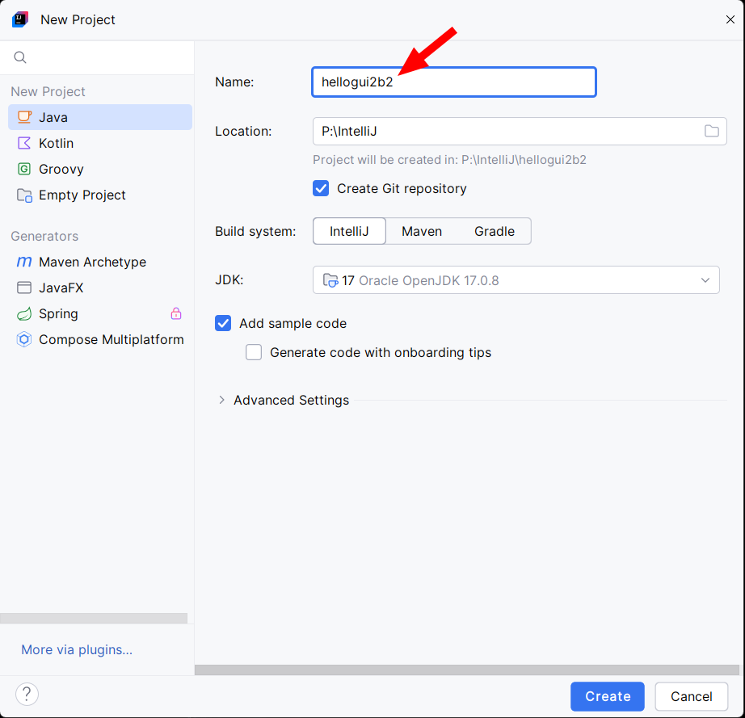
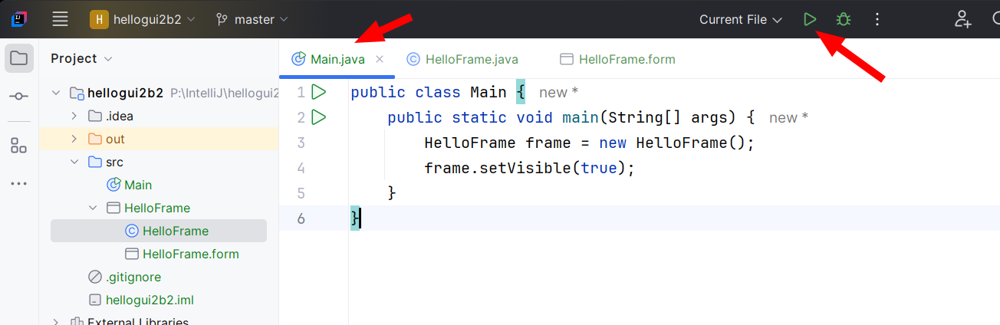

# Hello World s GUI v Javě (IDEA + SWING)

Předpokládáme, že vývojové prostředí IntelliJ IDEA máš již nainstalované.

> Návod je vytvořen ve verzi 2024.3.1.1.

## Instalace pluginu Swing GUI Designer

Nástroje pro tvorbu grafického rozhraní jsou součástí pluginu Swing GUI Designer. Ten stačí nainstalovat jednou. U dalších projektů už tento krok nebude třeba:


## Vytvoření projektu Hello GUI

Nyní již vytvoříš projekt stejně jako normálně.




Do projektu je třeba přidat formulář okna.


Do formuláře nyní můžeš přetáhnout grafické prvky. Zkus třeba tlačítko.


Prvky je vhodné pojmenovat. Nenechávej prvkům výchozí pojmenování `button1` apod.


Pojmenovat je třeba i hlavní panel formuláře. Pomocí tohoto názvu pak panel propojíš s&nbsp;oknem.


Nyní zapiš kód hlavního okna:
1. Nezapomeň na `extends JFrame`, aby se aplikace uměla chovat jako okno (využíváme dědičnost ze třídy `JFrame`).
2. Vytvoř si pomocnou metodu `initComponents`, kterou zavoláš v&nbsp;konstruktoru
3. Potřebujeme:
    - Přiřadit k&nbsp;oknu vytvořený panel s&nbsp;formulářem: `setContentPane` &mdash; zde použij název hlavního panelu vytvořeného formuláře
    - Nastavit titulek okna: `setTitle` &mdash; text se objeví v titulkové liště okna (nahoře)
    - Zajistit, aby se okno při stisknutí zavíracího tlačítka zavřelo: `setDefaultCloseOperation(EXIT_ON_CLOSE)`
    - Nastavit velikost okna: `pack()` nebo `setSize(x, y)`

Celý kód máš zde:
```java
import javax.swing.*;

public class HelloFrame extends JFrame {
    private JButton btStart;
    private JPanel pnMain;

    public HelloFrame() {
        initComponents();
    }

    private void initComponents() {
        setContentPane(pnMain);
        setTitle("Hello GUI");
        setDefaultCloseOperation(EXIT_ON_CLOSE);
        pack();
        //setSize(300, 300);
       btStart.addActionListener(e -> pozdrav());
   }
}
```


V&nbsp;metodě `main` pak stačí vytvořit objekt okna a nastavit, aby bylo viditelné:
```java
public class Main {
    public static void main(String[] args) {
        HelloFrame frame = new HelloFrame();
        frame.setVisible(true);
    }
}
```


## Reakce na tlačítko

Aby tlačítko něco dělalo, musíš mu přiřadit _listener_. Přiřaď mu metodu, která se spustí při stisknutí tlačítka:
```java
import javax.swing.*;

public class HelloFrame extends JFrame {
    private JButton btStart;
    private JPanel pnMain;

    public HelloFrame() {
        initComponents();
    }

    private void initComponents() {
        setContentPane(pnMain);
        setTitle("Hello GUI");
        setDefaultCloseOperation(EXIT_ON_CLOSE);
        pack();
        //setSize(300, 300);
        btStart.addActionListener(e -> pozdrav());
    }

    private void pozdrav() {
        JOptionPane.showMessageDialog(
                this, "Hello GUI!");
    }
}
```


Nyní můžeš kód spustit:



Pro lepší manipulaci s&nbsp;oknem můžeš oknu nastavit přesné rozměry, aby okno bylo větší:
